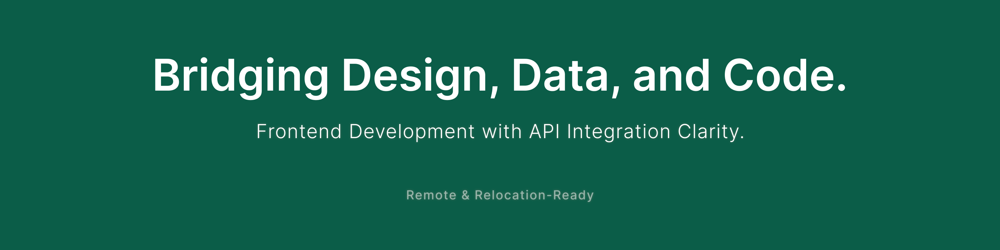

# Hi there, I'm Yoko — a Frontend Developer Bridging Design, Data, and Code 👋

🚀 Based in Georgia (UTC+4), I work with async-first, trust-based teams around the world. I focus on delivering clear, accessible interfaces through freelance projects, contract roles, and full-time collaborations. Also open to relocation with visa sponsorship to work closely with teams in their country.

I specialize in bridging design, data, and development — turning complex ideas into accessible, maintainable interfaces with clear, user-centered thinking, seamless API integration, and robust database access.  

💡 My approach combines:

- Frontend development (React / Next.js / TypeScript)
- UX-informed architecture and clear component design
- API integration planning and implementation
- Collaborative, async-friendly workflows for freelance, contract, or full-time projects

---

## 🌿 I believe in a structure that supports trust and autonomy.

Whether working independently or as part of a distributed team,  
I focus on clarifying requirements, sharing ideas early, and delivering code that respects users and teammates alike.

🔍 I’m currently deepening my accessibility practice — learning to design and build with inclusion from the start. I see accessibility not just as a checklist, but as a way to sharpen engineering, UX, and real-world care.

📖 I also write about what I learn:  
[How Accessibility Became a New Lens in My Work – and Why I'm Learning to See More Clearly ↗](https://medium.com/@yokoworks.dev/how-accessibility-became-a-new-lens-in-my-work-and-why-im-learning-to-see-more-clearly-5f7e2a6d5cc5)

✨ One of my recent articles — [From Universal Design to Personalized Interfaces ↗](https://medium.com/@yokoworks.dev/from-universal-design-to-personalized-interfaces-rethinking-accessibility-3f0d9b31150b) — was featured in [Bootcamp (UX Collective)](https://bootcamp.uxdesign.cc), a curated UX publication reaching 3M+ monthly readers.

🧠 Recently, I’ve been working on:

- Designing and implementing frontend architecture in async environments  
- Building maintainable, modular UI components from Figma  
- Planning and implementing API integration with backend teams  
- Translating design insights into testable code with clear documentation  

---

### 📦 Sample Projects

A curated selection showcasing API integration, frontend architecture, and user-centered design.

---

#### 🌐 Web3 EdTech Platform  
Sole frontend developer in a 4-person async team. Designed API contracts, aligned Prisma DB schema, and implemented secure Metamask authentication for Web3 onboarding.  
✅ Next.js / TypeScript / Prisma / API Integration  
🔗 [View Case Study](https://abiding-snap-e4c.notion.site/Web3-EdTech-Platform-Freelance-UX-Focused-Frontend-215994322fd5805abb2efcdd9afd042d?pvs=143)

---

#### 🗂️ Automated Monthly PDF Report Tool  
Built an internal reporting tool that generates multi-page client PDFs. Defined API contracts, integrated Prisma queries, and automated generation with Puppeteer.  
✅ React / TypeScript / Prisma / Puppeteer  
🔗 [View Case Study](https://abiding-snap-e4c.notion.site/Automated-Monthly-PDF-Report-Tool-232994322fd580f997a5ce5d05c44795)

---

#### 📈 Tracking App – Fullstack Habit Tracker  
Solo-built full-stack app with Rails REST API and React/Redux frontend. Focused on clear UX flows, maintainable data schema, and frictionless daily logging.  
✅ React / Redux / Rails / REST API  
🔗 [GitHub Repo](https://github.com/yoko-vicky/Tracking-App-with-React-Redux)

---

#### 🎬 My Favorite Movies – Searchable Movie Library  
Fullstack app with secure Google login, Supabase/Postgres DB, and Prisma-based API integration. Designed clear search UX with personalized movie lists.  
✅ Next.js / Supabase / Prisma / Authentication  
🔗 [GitHub Repo](https://github.com/yoko-vicky/MyFavoriteMovies)

---

#### 🧩 UX-Oriented Website Redesign  
Led a UX-driven overhaul for a mid-sized beauty appliance brand. Improved clarity, trust, and conversion by restructuring content and user flows.  
✅ Information Architecture / User Flow / Content Strategy  
📈 Results: +174% sessions / –7% bounce rate  
🔗 [View Case Study](https://abiding-snap-e4c.notion.site/UX-Oriented-Website-Redesign-for-a-Beauty-Appliance-Brand-215994322fd581c9baa0c654756bc1c2?pvs=143)

---

#### 💡 Tipshelf – Internal Knowledge Sharing Tool  
UX case study exploring structured contribution and clear interface flows for async teams.  
✅ UX Architecture / Tagging System / Prototyping  
🔗 [View Case Study](https://abiding-snap-e4c.notion.site/Tipshelf-UX-Case-Study-215994322fd581be9112cd4174f4ae3d)

---

#### 🍓 Grab Fruits – Solo Game Design & Development *(Optional)*  
Browser game built from concept to code. Explored intuitive gameplay loops, minimal UI, and clear feedback for players.  
✅ JavaScript / Phaser / Game UX  
🔗 [GitHub Repo](https://github.com/yoko-vicky/Glab-Fruits)

---

#### 🪷 Retrospective Lite *(Optional)*  
A self-initiated UX tool for remote teams to reflect more inclusively with structured, low-pressure prompts.  
✅ UX Facilitation / Remote Team Design  
🔗 [View Case Study](https://abiding-snap-e4c.notion.site/Retrospective-Lite-A-Gentle-Canvas-for-Reflection-in-Remote-Teams-215994322fd581f0ae9af6011f6d9aff)

---

## 📘 Portfolio & Contact

🧭 [Yoko | Portfolio & Services](https://www.yokoworks.dev/)  
💬 [Let’s connect on LinkedIn](https://www.linkedin.com/in/yoko-vicky/)  
📰 [Read Articles on Medium](https://medium.com/@yokoworks.dev)

---

Thanks for stopping by!  
If you're looking for a frontend developer who bridges design and engineering — thriving on self-direction, collaboration, and clear communication...
