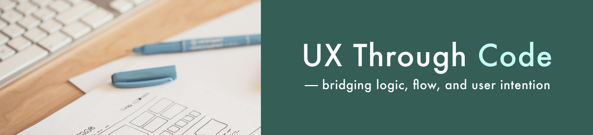

# Hi there, I'm Yoko — a UX-Focused Frontend Developer who values Collaboration and Self-Direction 👋

🚀 Based in Georgia (UTC+4), I work with async-first, trust-based teams — blending independent problem-solving with open, respectful collaboration.

I specialize in bridging design and development, turning complex ideas into accessible, maintainable interfaces through clear, user-centered thinking.

💡 My approach combines:
- Frontend development (React / Next.js / TypeScript)
- UX-focused architecture and structural design
- Collaborative, async-first workflows that value shared understanding over hierarchy

---

## 🌿 I believe in structure that supports trust and autonomy.

Whether working independently or as part of a distributed team,  
I focus on clarifying requirements, sharing ideas early, and delivering code that respects users and teammates alike.

🧠 Recently I’ve been working on:
- Designing and implementing frontend architecture in async environments
- Building lightweight design systems that balance consistency and flexibility
- Translating UX insights into modular, testable code with clear documentation

---

### 📦 Sample Projects

A selection of self-initiated and client projects where UX thinking, ownership, and collaborative problem-solving come together.

---

#### 🧩 Website Redesign for a Beauty Appliance Brand  
Redesign focused on clarity, trust, and conversion.  
→ Improved information structure, messaging alignment, and user flows.

📈 Results: +174% sessions / –7% bounce rate  
🔗 [View Project](https://abiding-snap-e4c.notion.site/UX-Oriented-Website-Redesign-for-a-Beauty-Appliance-Brand-215994322fd581c9baa0c654756bc1c2)

---

#### 🧠 Cultivating a Knowledge-Sharing Habit  
Framed and designed a lightweight system to support open knowledge sharing in global teams.  
→ Helped teams build trust and sustainable documentation habits.

🔗 [View Project](https://abiding-snap-e4c.notion.site/Cultivating-a-Knowledge-Sharing-Habit-in-Global-Teams-215994322fd581d3816cfc814d16ca58?pvs=143)

---

#### 🗂️ Tipshelf — UX Case Study for Reusable Team Insights  
Concept for async teams to share insights transparently.  
→ Focused on tagging, structure, and reducing communication overhead.

🔗 [View Notion Case Study](https://abiding-snap-e4c.notion.site/Tipshelf-UX-Case-Study-215994322fd581be9112cd4174f4ae3d?pvs=143)

---

#### 🧃 Behavioral Modes in Teams — UX Exploration  
Mapped how team behavior adapts to structure and culture.  
→ Explored dynamics of trust, safety, and shared understanding in async contexts.

🔗 [View Project](https://abiding-snap-e4c.notion.site/Behavioral-Modes-in-Team-Contexts-215994322fd581509794c974e9772e9e)

---

#### 🍓 Grab Fruits — Solo Game Development  
A solo-built browser game exploring intuitive feedback loops.  
→ Emphasized player understanding through clear design and code.

🔗 [Live Demo](https://grab-fruits-yocosaka.netlify.app/) | 🔗 [GitHub Repo](https://github.com/yoko-vicky/Glab-Fruits)

---

#### 🎬 Moviees — Searchable Movie App (Next.js & Supabase)  
A solo project with auth and filtering.  
→ Focused on clear search UX, result readability, and maintainable logic.

🔗 [GitHub Repo](https://github.com/yoko-vicky/MyFavoriteMovies)

---

## 📘 Portfolio & Contact

🧭 [UX-Focused Frontend Portfolio](https://www.yokoworks.dev/)  
💬 [Let’s connect on LinkedIn](https://www.linkedin.com/in/yoko-vicky/)

---

Thanks for stopping by!  
If you're looking for a UX-Focused Frontend Developer who thrives on self-direction and collaboration, feel free to reach out.  
I'm always open to thoughtful, trust-based teamwork.
