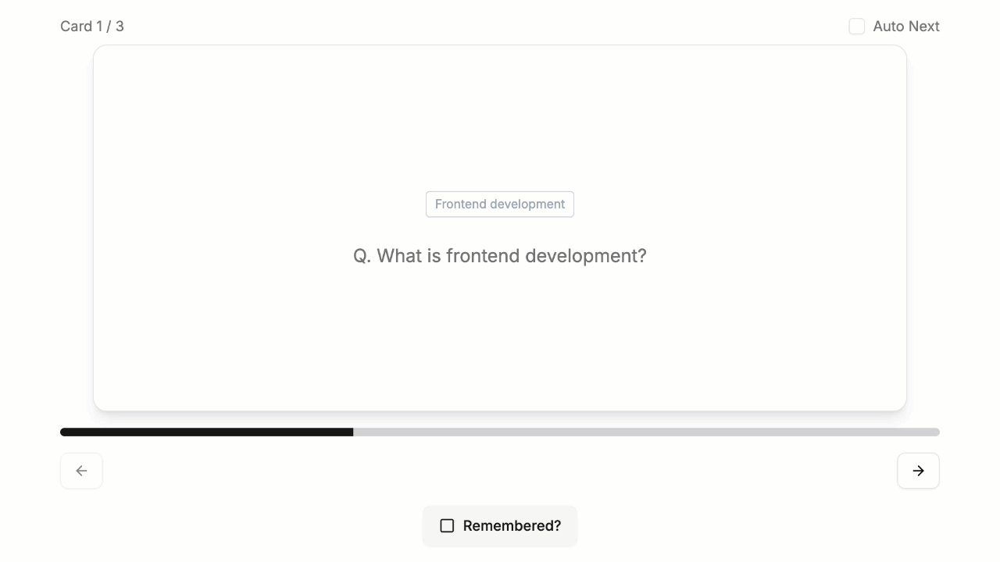
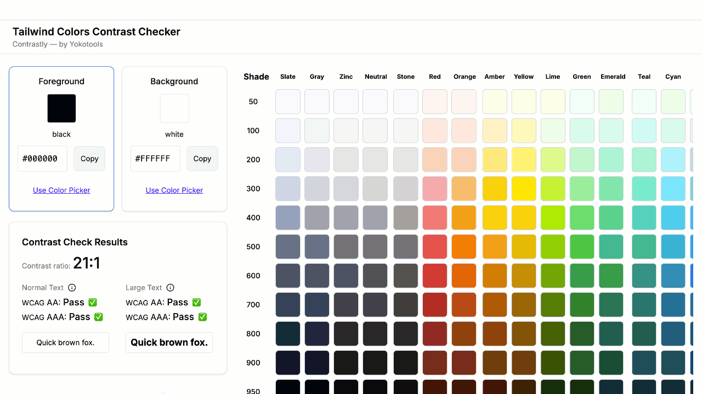

# Hi, I'm Yoko — a Frontend Developer Bridging Design Logic and Data Flow 👋

🚀 I work with async-friendly, trust-based teams around the world — remote, hybrid, or on-site.  
I focus on delivering accessible, maintainable, and intuitive interfaces — translating UX thinking into aligned frontend–backend flows.  
My work often involves defining API contracts from frontend needs, aligning logic with data shape, and reducing ambiguity between designers and backend engineers.

💡 My approach combines:

- Frontend development (React / Next.js / TypeScript)
- UX-driven architecture and async-friendly component structure
- API contract definition and integration based on frontend logic
- Clear communication in distributed, trust-based teams

---

## 🌟 Main Projects

### 🗣️ Promotee — Interview Flashcard App (A11y by Design)

Practice your own answers out loud — built with accessibility at the core.  
✅ Next.js / TypeScript / Tailwind CSS / Zustand / A11y by Design

🚀 [Try the App](https://www.promotee.app/)  
🛠 [View Case Study](https://abiding-snap-e4c.notion.site/Interview-Flashcard-App-A11Y-by-Design-In-Progress-249994322fd5806eb993deffb22cc09c?pvs=74)  
📝 [Read the Story on Medium](https://medium.com/@yokoworks.dev/what-building-my-first-a11y-focused-app-taught-me-7a2811de2fb1)

---

### 🎨 Contrastly — Tailwind Colors Contrast Checker

A lightweight tool for devs to check Tailwind colors against WCAG AA/AAA in real time.  
Handy for frontend devs, backend engineers touching UI, or anyone aiming for **100/100 Lighthouse accessibility scores**.

✅ Next.js / TypeScript / Tailwind CSS

🔗 [Open App](https://contrastly.yokotools.dev/)  
ℹ️ [About](https://contrastly.yokotools.dev/about)

---

## 🔎 Other Selected Projects

- Web3 EdTech Platform — Async frontend dev, API contracts, secure Metamask login. [Case Study ↗](https://abiding-snap-e4c.notion.site/Web3-EdTech-Platform-Freelance-UX-Focused-Frontend-215994322fd5805abb2efcdd9afd042d?pvs=143)
- Automated PDF Report Tool — Prisma queries + Puppeteer for reports. [Case Study ↗](https://abiding-snap-e4c.notion.site/Automated-Monthly-PDF-Report-Tool-232994322fd580f997a5ce5d05c44795)
- UX-Oriented Website Redesign — IA + flow restructure, boosted sessions +174%. [Case Study ↗](https://abiding-snap-e4c.notion.site/UX-Oriented-Website-Redesign-for-a-Beauty-Appliance-Brand-215994322fd581c9baa0c654756bc1c2?pvs=143)
- Tracking App — Fullstack habit tracker (Rails + React/Redux). [GitHub Repo ↗](https://github.com/yokoworks/Tracking-App-with-React-Redux)
- Movie Library — Next.js + Supabase + Prisma + Auth. [GitHub Repo ↗](https://github.com/yokoworks/MyFavoriteMovies)

---

## 🌿 I believe in a structure that supports trust and autonomy.

Whether working independently or as part of a distributed team,  
I focus on clarifying requirements, sharing ideas early, and delivering code that respects users and teammates alike.

🔍 I’m currently deepening my accessibility practice — learning to design and build with inclusion from the start.  
I see accessibility not just as a checklist, but as a way to sharpen engineering, UX, and real-world care.

📖 I also write about what I learn:  
[How Accessibility Became a New Lens in My Work ↗](https://medium.com/@yokoworks.dev/how-accessibility-became-a-new-lens-in-my-work-and-why-im-learning-to-see-more-clearly-5f7e2a6d5cc5)

✨ One of my recent articles — [From Universal Design to Personalized Interfaces ↗](https://medium.com/@yokoworks.dev/from-universal-design-to-personalized-interfaces-rethinking-accessibility-3f0d9b31150b) — was featured in [Bootcamp (UX Collective)](https://bootcamp.uxdesign.cc), a curated UX publication reaching 3M+ monthly readers.

🧠 Recently, I’ve been working on:

- Designing and implementing frontend architecture in async environments
- Aligning UI logic with backend structure and defining API contracts
- Building modular, maintainable UI components from Figma
- Translating design insights into testable, clear code with documentation

---

## 📘 Portfolio & Contact

🧭 [Yoko | Portfolio & Services](https://www.yokoworks.dev/)  
💬 [Let’s connect on LinkedIn](https://www.linkedin.com/in/yokoworks/)  
📰 [Read Articles on Medium](https://medium.com/@yokoworks.dev)  
📝 [Dev.to | Developer-focused posts](https://dev.to/yokoworks)  
🐣 [New to X (starting from zero, as we all do!)](https://x.com/yokoworks)

---

I’m especially passionate about clarifying logic across layers — from user flows to database design — to build products that feel simple, even when they aren’t.

Thanks for stopping by!  
If you're looking for a frontend developer who bridges design and engineering, let’s build something thoughtful together.
