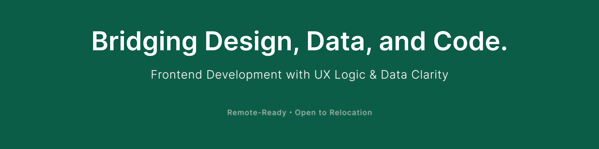

# Hi, I'm Yoko — a Frontend Developer Bridging Design Logic and Data Flow 👋

🚀 I work with async-friendly, trust-based teams around the world — remote, hybrid, or on-site.
I focus on delivering accessible, maintainable, and intuitive interfaces — translating UX thinking into aligned frontend–backend flows.  
My work often involves defining API contracts from frontend needs, aligning logic with data shape, and reducing ambiguity between designers and backend engineers.

💡 My approach combines:

- Frontend development (React / Next.js / TypeScript)
- UX-driven architecture and async-friendly component structure
- API contract definition and integration based on frontend logic
- Clear communication in distributed, trust-based teams

---

## 🌿 I believe in a structure that supports trust and autonomy.

Whether working independently or as part of a distributed team,  
I focus on clarifying requirements, sharing ideas early, and delivering code that respects users and teammates alike.

🔍 I’m currently deepening my accessibility practice — learning to design and build with inclusion from the start. I see accessibility not just as a checklist, but as a way to sharpen engineering, UX, and real-world care.

📖 I also write about what I learn:  
[How Accessibility Became a New Lens in My Work – and Why I'm Learning to See More Clearly ↗](https://medium.com/@yokoworks.dev/how-accessibility-became-a-new-lens-in-my-work-and-why-im-learning-to-see-more-clearly-5f7e2a6d5cc5)

✨ One of my recent articles — [From Universal Design to Personalized Interfaces ↗](https://medium.com/@yokoworks.dev/from-universal-design-to-personalized-interfaces-rethinking-accessibility-3f0d9b31150b) — was featured in [Bootcamp (UX Collective)](https://bootcamp.uxdesign.cc), a curated UX publication reaching 3M+ monthly readers.

🧠 Recently, I’ve been working on:

- Designing and implementing frontend architecture in async environments
- Aligning UI logic with backend structure and defining API contracts
- Building modular, maintainable UI components from Figma
- Translating design insights into testable, clear code with documentation

---

### 📦 Selected Projects: API & Schema Design, UX–Backend Logic, Data Integration, and Interface Clarity

A curated selection showcasing API & Schema Design, frontend architecture, and user-centered design.

---

#### 🧠 A11y-Focused Interview Flashcard App

Real-world accessibility-focused app for non-native English speakers to practice job interviews. Built from the ground up with WCAG compliance, screen reader support, and full keyboard accessibility.

✅ Next.js / TypeScript / Tailwind CSS / Zustand / A11y by Design  
🚀 [Try the App](https://www.promotee.app/)  
🛠 [View Case Study](https://abiding-snap-e4c.notion.site/Interview-Flashcard-App-A11Y-by-Design-In-Progress-249994322fd5806eb993deffb22cc09c?pvs=74)  
📝 [Read the Story on Medium](https://medium.com/@yokoworks.dev/what-building-my-first-a11y-focused-app-taught-me-7a2811de2fb1)

---

#### 🌐 Web3 EdTech Platform

Sole frontend developer in a 4-person async team. Designed API contracts, aligned Prisma DB schema, and implemented secure Metamask authentication for Web3 onboarding.  
✅ Next.js / TypeScript / Prisma / API & Schema Design    
🔗 [View Case Study](https://abiding-snap-e4c.notion.site/Web3-EdTech-Platform-Freelance-UX-Focused-Frontend-215994322fd5805abb2efcdd9afd042d?pvs=143)

---

#### 🗂️ Automated Monthly PDF Report Tool

Built an internal reporting tool that generates multi-page client PDFs. Defined API contracts, integrated Prisma queries, and automated generation with Puppeteer.  
✅ React / TypeScript / Prisma / Puppeteer    
🔗 [View Case Study](https://abiding-snap-e4c.notion.site/Automated-Monthly-PDF-Report-Tool-232994322fd580f997a5ce5d05c44795)

---

#### 🧩 UX-Oriented Website Redesign

Led a UX-driven overhaul for a mid-sized beauty appliance brand. Improved clarity, trust, and conversion by restructuring content and user flows.  
✅ Information Architecture / User Flow / Content Strategy  
📈 Results: +174% sessions / –7% bounce rate    
🔗 [View Case Study](https://abiding-snap-e4c.notion.site/UX-Oriented-Website-Redesign-for-a-Beauty-Appliance-Brand-215994322fd581c9baa0c654756bc1c2?pvs=143)

---

#### 📈 Tracking App – Fullstack Habit Tracker

Solo-built full-stack app with Rails REST API and React/Redux frontend. Focused on clear UX flows, maintainable data schema, and frictionless daily logging.  
✅ React / Redux / Rails / REST API    
🔗 [GitHub Repo](https://github.com/yoko-vicky/Tracking-App-with-React-Redux)

---

#### 🎬 My Favorite Movies – Searchable Movie Library

Fullstack app with secure Google login, Supabase/Postgres DB, and Prisma-based API & Schema Design. Designed clear search UX with personalized movie lists.  
✅ Next.js / Supabase / Prisma / Authentication    
🔗 [GitHub Repo](https://github.com/yoko-vicky/MyFavoriteMovies)

---

#### 🍓 Grab Fruits – Solo Game Design & Development _(Optional)_

Browser game built from concept to code. Explored intuitive gameplay loops, minimal UI, and clear feedback for players.  
✅ JavaScript / Phaser / Game UX    
🔗 [GitHub Repo](https://github.com/yoko-vicky/Glab-Fruits)

---

## 📘 Portfolio & Contact

🧭 [Yoko | Portfolio & Services](https://www.yokoworks.dev/)  
💬 [Let’s connect on LinkedIn](https://www.linkedin.com/in/yoko-vicky/)  
📰 [Read Articles on Medium](https://medium.com/@yokoworks.dev)  
🐣 [New to X (starting from zero, as we all do!) ](https://x.com/yokoworks)

---

I’m especially passionate about clarifying logic across layers — from user flows to database design — to build products that feel simple, even when they aren’t.

Thanks for stopping by!  
If you're looking for a frontend developer who bridges design and engineering, let’s build something thoughtful together.
